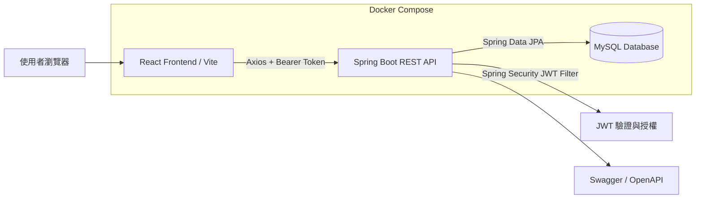
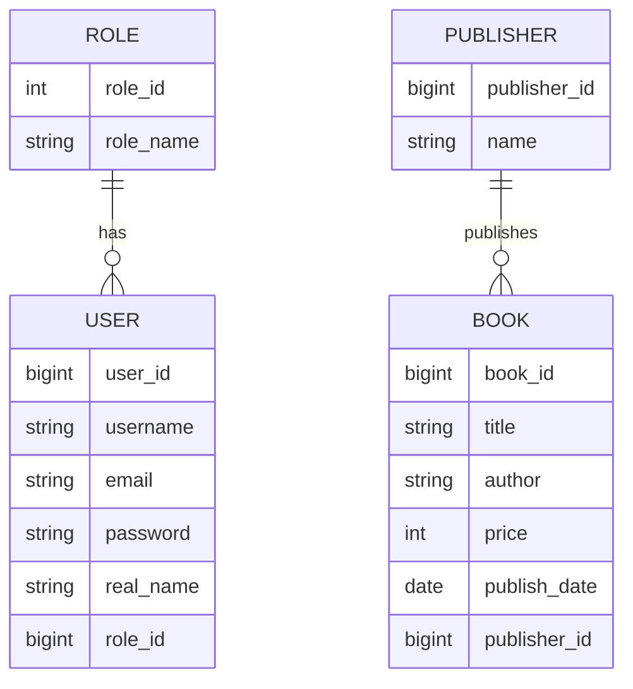

# Book EMS 書本管理系統

> 一個以 **Spring Boot + React + MySQL + Docker** 建構的全端書本管理系統，具備 JWT 登入驗證、角色權限控管、RESTful API、分頁搜尋、Swagger API 文件與 VPS 自動化部署流程。  
> 本專案可作為 Java Backend / Full Stack Engineer 面試展示作品。

---
## 線上展示

- 線上 Demo：https://ems.jensen-store.online/books
- API 文件：https://ems-api.jensen-store.online/swagger-ui/index.html

## Demo 測試帳號

| 角色 | 帳號 | 密碼 | 可操作功能 |
|---|---|---|---|
| 管理員 | admin | adminPass | 書籍新增、查詢、更新、刪除 |
| 一般使用者 | user1 | password1 | 瀏覽書籍、搜尋書籍 |

> 注意：此 Demo 僅作為面試與作品展示用途，資料可能會定期重置。
## 目錄

- [專案簡介](#專案簡介)
- [核心功能](#核心功能)
- [技術棧](#技術棧)
- [系統架構](#系統架構)
- [專案亮點](#專案亮點)
- [資料庫設計](#資料庫設計)
- [API 設計](#api-設計)
- [快速開始](#快速開始)
- [環境變數設定](#環境變數設定)
- [部署流程](#部署流程)
- [專案結構](#專案結構)
- [面試說明重點](#面試說明重點)
- [未來優化方向](#未來優化方向)

---

## 專案簡介

Book EMS 是一個書本管理系統，主要用來管理書籍、作者、價格、出版日期與出版社資料。系統採用前後端分離架構：

- 前端使用 React + Vite 建立 SPA 單頁應用
- 後端使用 Spring Boot 建立 RESTful API
- 資料庫使用 MySQL 儲存書籍、出版社、使用者與角色資料
- 使用 Spring Security + JWT 實作無狀態登入驗證
- 使用 Docker Compose 整合前端、後端與資料庫服務
- 使用 GitHub Actions 透過 SSH 自動部署至 VPS

本專案不只是基本 CRUD，也加入了實務開發中常見的驗證、授權、DTO 分層、例外處理、Swagger 文件、N+1 查詢優化與 CI/CD 部署流程。

---

## 核心功能

### 使用者認證與權限

- 使用者註冊
- 使用者登入
- JWT Token 簽發與驗證
- 前端自動攜帶 Bearer Token
- Token 失效時自動導回登入頁
- 角色權限控管
    - `ROLE_USER`：可瀏覽與搜尋書籍
    - `ROLE_ADMIN`：可新增、更新、刪除書籍

### 書籍管理

- 取得書籍列表
- 根據 ID 查詢單一本書
- 新增書籍
- 更新書籍
- 刪除書籍
- 依書名或作者模糊搜尋
- 支援分頁、排序
- 書籍可關聯出版社

### 系統與開發體驗

- Swagger / OpenAPI 文件
- DTO 與 Entity 分離
- Bean Validation 請求資料驗證
- Global Exception Handler 統一錯誤回應
- Spring Data JPA Repository 分層
- `@EntityGraph` 優化 Publisher 關聯查詢，降低 N+1 Query 問題
- Docker 多階段建置後端映像檔
- Docker Compose 一鍵啟動 MySQL、Backend、Frontend
- GitHub Actions 自動部署到 VPS

---

## 技術棧

| 分類 | 技術 |
|---|---|
| 前端 | React, Vite, React Router, Bootstrap, Axios |
| 後端 | Java 17, Spring Boot, Spring MVC, Spring Security, Spring Data JPA |
| 認證授權 | JWT, Bearer Token, Role-Based Access Control |
| 資料庫 | MySQL 8.0, Hibernate ORM |
| API 文件 | Springdoc OpenAPI / Swagger UI |
| 建置工具 | Maven, npm |
| 容器化 | Docker, Docker Compose |
| 部署 | GitHub Actions, SSH, VPS |
| 其他 | Lombok, Bean Validation, Global Exception Handling |

---

## 系統架構



---

## 專案亮點

### 1. JWT 無狀態認證

後端使用 Spring Security 搭配自訂 JWT Filter，在每次請求進入 Controller 前檢查 `Authorization: Bearer <token>`。驗證成功後，將使用者資訊放入 `SecurityContextHolder`，使後續 API 可以根據登入狀態與角色進行授權。

### 2. 角色權限控管

書籍查詢 API 允許登入使用者使用，但新增、更新與刪除書籍限制為管理員角色：

```java
@PreAuthorize("hasRole('ADMIN')")
```

這讓系統具備基本的 RBAC 權限模型，符合實務後端常見的安全設計。

### 3. DTO 與 Entity 分離

系統沒有直接把 Entity 暴露給前端，而是透過 `BookDto`、`UserDTO`、`PageResponseDto` 等 DTO 控制輸出格式，避免資料庫模型與 API 回應過度耦合。

### 4. 分頁、排序與搜尋

書籍列表與搜尋功能支援：

- `pageNo`
- `pageSize`
- `sortBy`
- `sortDir`
- `text` 關鍵字搜尋

這讓 API 更接近實務上的資料列表需求。

### 5. 解決 N+1 Query 問題

書籍與出版社為多對一關係。查詢書籍列表時，前端需要顯示出版社名稱，因此 Repository 使用 `@EntityGraph(attributePaths = {"publisher"})` 預先載入出版社資料，避免每本書額外查詢一次 Publisher。

### 6. 統一例外處理

後端透過 `@RestControllerAdvice` 統一處理：

- 參數驗證錯誤
- 資源不存在錯誤
- 系統未預期錯誤

讓前端可以收到一致的錯誤格式，也方便除錯與維護。

### 7. 容器化與部署流程

專案使用 Docker Compose 啟動三個主要服務：

- MySQL database
- Spring Boot backend
- React frontend

並透過 GitHub Actions 在 push 到 `main` 分支後，自動 SSH 到 VPS，更新程式碼、產生 `.env`、重新建置並啟動容器。

---

## 資料庫設計

### 主要資料表

| Table | 說明 |
|---|---|
| `users` | 使用者資料，包含帳號、Email、密碼、真實姓名與帳號狀態 |
| `roles` | 使用者角色，例如 `ROLE_USER`、`ROLE_ADMIN` |
| `book` | 書籍資料，包含書名、作者、價格、出版日期與出版社 ID |
| `publisher` | 出版社資料 |

### Entity 關係



---

## API 設計

### Authentication API

| Method | Endpoint | 權限 | 說明 |
|---|---|---|---|
| POST | `/api/auth/public/signup` | Public | 註冊新使用者 |
| POST | `/api/auth/public/signin` | Public | 使用者登入並取得 JWT |
| GET | `/api/auth/user` | Authenticated | 取得目前登入使用者資訊 |
| GET | `/api/auth/username` | Authenticated | 取得目前登入使用者名稱 |

### Book API

| Method | Endpoint | 權限 | 說明 |
|---|---|---|---|
| GET | `/api/books` | Authenticated | 取得書籍分頁列表 |
| GET | `/api/books/{id}` | Authenticated | 根據 ID 查詢書籍 |
| GET | `/api/books/search?text=keyword` | Authenticated | 依書名或作者搜尋 |
| POST | `/api/books` | Admin | 新增書籍 |
| PUT | `/api/books/{id}` | Admin | 更新書籍 |
| DELETE | `/api/books/{id}` | Admin | 刪除書籍 |

### 查詢參數範例

```http
GET /api/books?pageNo=0&pageSize=5&sortBy=bookId&sortDir=desc
GET /api/books/search?text=Java&pageNo=0&pageSize=10&sortBy=bookId&sortDir=desc
```

### 登入範例

```bash
curl -X POST http://localhost:8081/api/auth/public/signin \
  -H "Content-Type: application/json" \
  -d '{
    "username": "your_username",
    "password": "your_password"
  }'
```

### 新增書籍範例

```bash
curl -X POST http://localhost:8081/api/books \
  -H "Content-Type: application/json" \
  -H "Authorization: Bearer <JWT_TOKEN>" \
  -d '{
    "title": "Spring Boot 實戰",
    "author": "Jensen",
    "price": 650,
    "publishDate": "2024-01-01",
    "publisherId": 1
  }'
```

---

## 快速開始

### 前置需求

請先安裝：

- Java 17+
- Maven
- Node.js / npm
- Docker
- Docker Compose
- MySQL 8.0（若不使用 Docker）

---

## 使用 Docker Compose 啟動

### 1. 建立 `.env`

請在專案根目錄建立 `.env`：

```env
DB_ROOT_PASSWORD=your_root_password
DB_PASSWORD=your_database_password
JWT_SECRET=your_base64_jwt_secret
```

> 注意：`.env` 不應提交到 GitHub。若曾經把真實密碼或 JWT Secret commit 到版本庫，建議立即更換密碼並旋轉金鑰。

### 2. 啟動服務

```bash
docker compose up -d --build
```

### 3. 服務位置

| Service | URL |
|---|---|
| Frontend | `http://localhost:8085` |
| Backend API | `http://localhost:8081` |
| MySQL | `127.0.0.1:3307` |
| Swagger UI | `http://localhost:8081/swagger-ui.html` |

### 4. 停止服務

```bash
docker compose down
```

---

## 本機開發模式

### Backend

```bash
cd book-ems-jpa-backend
mvn spring-boot:run
```

開發環境預設使用：

```properties
spring.profiles.active=dev
spring.datasource.url=jdbc:mysql://localhost:3306/book_ems_db
spring.datasource.username=root
spring.datasource.password=root
```

### Frontend

```bash
cd book-ems-jpa-frontend
npm install
npm run dev
```

前端開發伺服器預設：

```text
http://localhost:3000
```

---

## 環境變數設定

| 變數 | 說明 |
|---|---|
| `DB_ROOT_PASSWORD` | MySQL root 密碼 |
| `DB_PASSWORD` | MySQL 應用程式帳號密碼 |
| `JWT_SECRET` | JWT 簽章用 Secret |
| `SPRING_PROFILES_ACTIVE` | Spring Boot profile，例如 `dev` 或 `prod` |
| `VITE_API_BASE_URL` | 前端 Axios 使用的後端 API Base URL |

---

## 部署流程

本專案已設計 GitHub Actions 自動部署流程：

1. 開發者 push 程式碼到 `main` 分支
2. GitHub Actions 啟動部署 workflow
3. 透過 SSH 登入 VPS
4. 若 VPS 尚未有專案，執行 `git clone`
5. 若已存在專案，執行 `git pull origin main`
6. 從 GitHub Secrets 動態產生 `.env`
7. 執行：

```bash
docker compose down
docker compose up -d --build
docker image prune -f
```

### GitHub Secrets

部署前需在 GitHub Repository Secrets 設定：

| Secret | 說明 |
|---|---|
| `VPS_HOST` | VPS IP 或網域 |
| `VPS_USERNAME` | VPS 使用者名稱 |
| `VPS_SSH_KEY` | SSH Private Key |
| `DB_ROOT_PASSWORD` | MySQL root 密碼 |
| `DB_PASSWORD` | MySQL app user 密碼 |
| `JWT_SECRET` | JWT Secret |

---

## 專案結構

```text
.
├── .github/
│   └── workflows/
│       └── deploy.yml
├── book-ems-jpa-backend/
│   ├── src/main/java/com/example/book/
│   │   ├── config/
│   │   │   └── SwaggerConfig.java
│   │   ├── controller/
│   │   │   ├── AuthController.java
│   │   │   └── BookController.java
│   │   ├── dto/
│   │   │   ├── BookDto.java
│   │   │   ├── PageResponseDto.java
│   │   │   └── ErrorResponseDto.java
│   │   ├── entity/
│   │   │   ├── Book.java
│   │   │   ├── Publisher.java
│   │   │   ├── User.java
│   │   │   ├── Role.java
│   │   │   └── AppRole.java
│   │   ├── exception/
│   │   │   ├── GlobalExceptionHandler.java
│   │   │   └── ResourceNotFoundException.java
│   │   ├── mapper/
│   │   │   └── BookMapper.java
│   │   ├── repository/
│   │   │   ├── BookRepository.java
│   │   │   ├── PublisherRepository.java
│   │   │   ├── UserRepository.java
│   │   │   └── RoleRepository.java
│   │   ├── security/
│   │   │   ├── SecurityConfig.java
│   │   │   ├── jwt/
│   │   │   ├── request/
│   │   │   ├── response/
│   │   │   └── services/
│   │   └── service/
│   ├── src/main/resources/
│   │   ├── application.properties
│   │   ├── application-dev.properties
│   │   ├── application-prod.properties
│   │   └── schema.sql
│   ├── Dockerfile
│   └── pom.xml
├── book-ems-jpa-frontend/
│   ├── src/
│   │   ├── components/
│   │   ├── services/
│   │   ├── store/
│   │   ├── App.jsx
│   │   └── main.jsx
│   ├── vite.config.js
│   └── package.json
├── docker-compose.yml
└── README.md
```

---

## 未來優化方向

- 加入 Refresh Token 機制
- 導入 Flyway 或 Liquibase 管理資料庫 migration
- 補齊 Unit Test 與 Integration Test
- 加入 Testcontainers 測試 MySQL 整合流程
- 增加出版社管理 API 與前端頁面
- 加入使用者管理與角色調整 UI
- 導入 Redis 快取熱門查詢
- 加入 Spring Actuator / Prometheus / Grafana 監控
- 使用 Nginx Reverse Proxy 與 HTTPS 自動憑證
- 強化 CI 流程，例如 build、test、lint 通過後才部署

---

## 專案狀態

此專案為面試作品與學習專案，已涵蓋 Java Backend 常見實務主題：

- RESTful API 設計
- Spring Boot 分層架構
- Spring Security + JWT
- JPA 關聯查詢與效能優化
- DTO / Mapper / Validation
- Docker 化部署
- GitHub Actions CI/CD

---

## License

此專案作為個人學習與面試展示用途。
